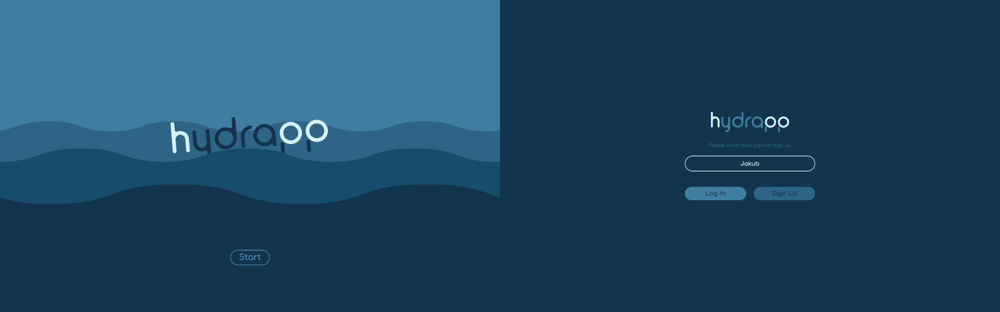
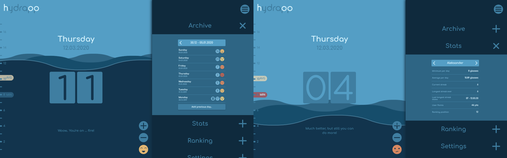
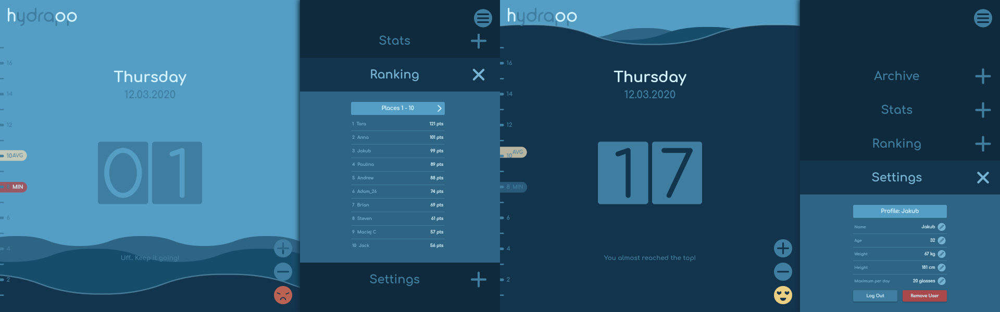

# hydrApp

## Project info
Simple yet useful app for daily tracking of water consumption. User can quickly get to basic app’s functionality and add (or remove) next glass of drank water what may help with not forgetting about this really important activity, especially during hot summer.. There’s also an archive section with an editable history entries divided on weeks, to have an overall insight into water consumption tendency. On top of that, user is able to change his account settings and view his or other users stats. I added some level of gamification in form of points collected by every user for 'minimum water' streaks. There is also an overall ranking of users, dynamically reacting to any change in users stats.

[Code](https://github.com/jchojna/hydrApp/tree/master)

[Demo](https://jchojna.github.io/hydrApp/)

## Features

* intro animation
* animated graphical representation of water
* animated counter displaying amount of consumed water
* editable archive section
* new archive entry creator
* emojis as water level indicators
* stats section displaying results of each user
* calculated current and longest user's streak
* ranking of users based on highest point score 
* settings section allowing to log out, remove account or edit profile settings
* responsiveness
* data stored in local storage as Json format

